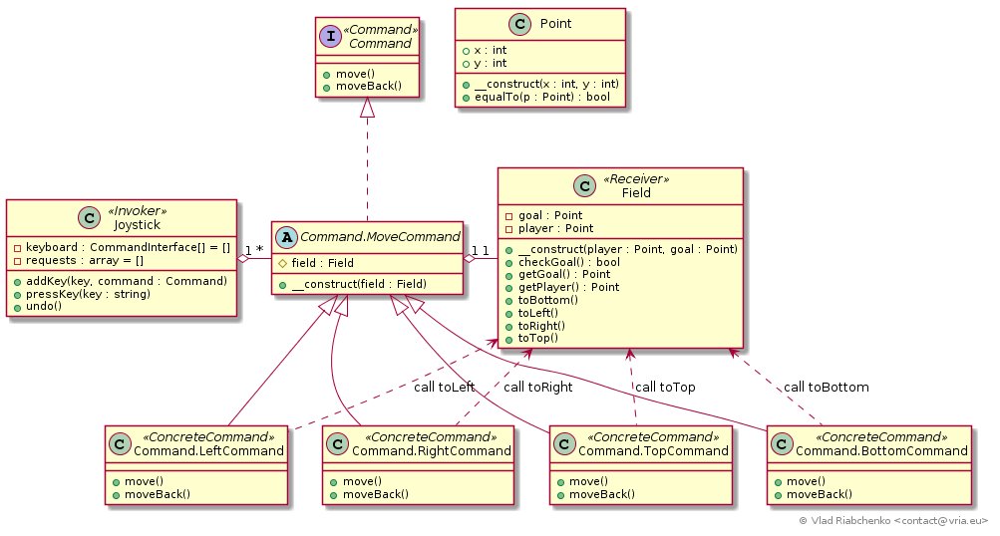

Command pattern (Action, Transaction)
=====================================

Given that one object `Invoker` calls a method of another object `Receiver`, 
it is possible to decouple `Invoker` and `Receiver` by means of `Command` object. 
The `Receiver`'s method that the `Invoker` wants to call (and the `Receiver` itself) is hidden behind `Command` object.

So instead of the situation where `Invoker` knows about `Receiver` class and its `someMethod` method :
```
Invoker 
{
    public function do() 
    {
        /**
         * Invoker is coupled directly with Receiver.
         *
         * @var $receiver Receiver 
         */
        $receiver->someMethod();
    }
}
```

you get

```
Invoker 
{
    public function do() 
    {
        /**
         * Invoker is coupled only with generic interface Command.
         * This could be any subclass of Command coupled with any receiver.
         *  
         * @var $command Command
         */
        $command->execute();
    }
}

/**
 * A generic command interface. The invoker is coupled only with this interface.
 */
interface Command 
{
    public function execute();
}

/**
 * A concreate command that can be coupled with anything (Receiver in this case).
 **/
ReceiverCommand extends Command 
{
    public function execute() 
    {
        /**
         * The concreate commend is coupled with receiver.
         * @var $receiver Receiver 
         */
        $receiver->someMethod();
    }
}
```

By encapsulating a specific method call `Receiver::someMethod()` in a generic interface `Command` 
you get the opportunity to parametrize the `Invoker` with absolutely any commands that result in calling any method of any recipient. 
The command pattern also brings additional opportunities like conserving the history of executed commands or undoing commands.

See [https://en.wikipedia.org/wiki/Command_pattern](https://en.wikipedia.org/wiki/Command_pattern) for more information.

## Implementation

Example implementation simulates a simple game control schema: 
a player aims to reach a goal by moving to left, right, top, bottom. 
The Joystick issues requests that are represented by strings "left", "right", "top", "bottom".
These strings are mapped to `Commands` that transmit the the joystick's requests to the `Field`.
The field stores the internal state of the game changing under the influence by joystick's requests.



Participants:
- [Field] (`Receiver`) really performs the operations and holds the current state of the game that changes when 
one of its methods are called `toLeft`, `toRight`, `toTop`, `toBottom`. This class knows nothing about other classes.
- [Command] (`Command`) declares the interface a generic operation `move` 
and the operation of undoing the last executed operation `moveBack`.
- [LeftCommand], [RightCommand], [BottomCommand], [TopCommand] (`ConcreteCommand`) 
are classes that directly call the methods of the `Field` and plays the role of a link between the `Joystick` and the `Field`.
- [Joystick] (`Invoker`): holds a mapping between the requests "left", "right", etc and the commands.
Note that `Joystick` is coupled only with `Command` interface and calls its generic methods `move` and `moveBack`.

This example can be enhanced by macro commands.

Check out [CommandTest] the see the proper use of these classes.

[Field]: Field.php
[Command]: Command.php
[LeftCommand]: Command/BottomCommand.php
[BottomCommand]: Command/BottomCommand.php
[RightCommand]: Command/RightCommand.php
[TopCommand]: Command/TopCommand.php
[Joystick]: Joystick.php
[CommandTest]: Test/CommandTest.php
