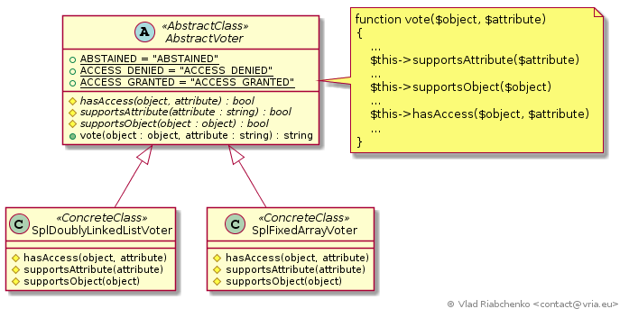

Template method
===============

This pattern suggests to define a skeleton of an algorithm in a template method of a certain class 
and then to redefine some of its steps to in subclasses. The algorithm structure remains unchanged and common for all subclasses. 

This pattern helps to make your code [DRY] (avoid code duplicating) 
and to implement [open/closed] (open for for extension, but closed for modification) principle.

In practice:

```
abstract class AbstractClass
{
    /**
     * The skeleton of algorithm that is unchanged for all subclasses.
     * However they are able to define another implementation of some steps.   
     */
    public function templateMethod() 
    {
        ...
        $this->operation1();
        if ($this->condition2($parameters)) {
            $this->operation3();        
        }
        ...
    }
    
    /**
     * Placeholder function 1 that is defined in subclass.
     */
    protected abstract function operation1();
    
    /**
     * Placeholder function 2 that is defined in subclass and requires some parameters.
     */
    protected abstract function condition2($canAcceptParameters);
    
    /**
     * Primitive function 3 that provides a default behaviour and can be redefined in subclass. 
     */
    protected function operation3() 
    {
        // default implementation        
    };
}

class ConcreteClass extends AbstractClass 
{
    /**
     * Function 1 gets defined.
     */
    protected function operation1() 
    {
        ...
    };
    
    /**
     * Function 2 gets defined.
     */
    protected function condition2($canAcceptParameters) 
    {
        ...
    };
}

$concreteClass->templateMethod(); // Using of the template method with redefined steps 
```

See [https://en.wikipedia.org/wiki/Template_method_pattern](https://en.wikipedia.org/wiki/Template_method_pattern) for more information.

## Implementation



As an example consider a security system for checking permissions. The special objects called voters are in charge of
deciding whether the `$attribute` is suitable to the `$object`. 
These voters decide whether the method (`$attribute`) of a object (`$object`) can be called. 
The method `vote` of each voter accepts two parameters (`$attribute`, `$object`) and return on of three possible results :
grant access, deny access and abstain (if the object or attribute is not supported by this particular voter).
After polling all the voters, the client code makes a final verdict according to some policy (but this is beyond this example).

All voters extend [AbstractVoter] that provides `vote` template method implementing a common algorithm of voting: 
if the object and attribute are supported then check access, abstain otherwise. 
Some steps of this algorithm are delegated to the following methods:
- `AbstractVoter::supportsObject($object)` checks if the object is supported by voter,
- `AbstractVoter::supportsAttribute($attribute)` checks if the attribute is supported by voter,
- `AbstractVoter::hasAccess($object, $attribute)` checks the access, returns `true` ir `false`.

These methods are not implemented in [AbstractVoter], the implementation is deferred to subclasses:
- [SplFixedArrayVoter] : the voter that checks if some methods of `\SplFixedArray` can be called,
- [SplDoublyLinkedListVoter] : the voter that checks if some methods of `\SplDoublyLinkedList` can be called.

None of these subclasses redefine `vote` method because it is general enough.

I recommend you to check out [SplFixedArrayVoterTest] and [SplDoublyLinkedListVoterTest] to see the use of these voters.

[AbstractVoter]: AbstractVoter.php
[SplFixedArrayVoter]: SplFixedArrayVoter.php
[SplDoublyLinkedListVoter]: SplDoublyLinkedListVoter.php
[SplFixedArrayVoterTest]: Test/SplFixedArrayVoterTest.php
[SplDoublyLinkedListVoterTest]: Test/SplDoublyLinkedListVoterTest.php
