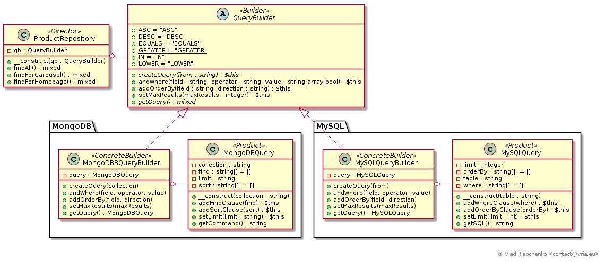

Builder
=======

The Builder pattern separates the algorithm of creating a complex object from its representation.
In other terms the algorithm that directs the creation and configuration of complex object does not depend on its 
actual class. Neither it depends on the actual classes of any object that compose a complex object.

This is achieved by hiding the complex object being build (`Product`) behind abstract `Builder` class.
`Builder` creates, configures and builds a `Product` object step by according to the commands it receives from `Director`:

```
// Depends on abstract builder only.
// Doesn't depend on `Product` class neither on other classes needed to configure a product instance. 
class Director 
{
    // The algorighm for creating a complex product object.
    // Returns either a builder with configured product in it or directly a configured product.
    public function getConfiguredProduct() 
    [
        // retrieve concrete builder in some way
        return $builder
            ->createProduct()   // Start building product
            ->addPartA($argsA1) // Add part A
            ->addPartA($argsA2) // Add another part A
            ->addPartB($argsB)  // Add part B
            ->setPartC($argsC)  // Set part C
            
            // Optionally return created and configured product. 
            // `getProduct()` method can be called from client that called `getConfiguredProduct`
            ->getProduct();
    }
}

// Declare an interfact for all product builders.
abstract class Builder 
{
    abstract public function createProduct();
    public function addPartA($argsA1) { return $this; };
    public function addPartB($argsB) { return $this; };
    public function setPartC($argsC) { return $this; };
    public function getProduct() { return $this; };
}

// Concreate builder that creates instances of `ProductA` class.
// This class is depoupled from `Director` as well as `ProductA` class and any class needed to asseble a `ProductA` instance.
class ConcreteBuilderA extends Builder 
{
    /**
     * The product under construction
     *
     * @var ProductA
     */
    private $product;
    
    public function createProduct() 
    {
        $this->product = new Product;
        
        // Allow for a fluent interface
        return $this;
    }
    
    public function addPartA($argsA1)
    {
        // Here goes any algorithm of adding a `partA` to the `$this->product` instance.
        // Note that if a `partA` is an instance of some class, then this class remains decoupled from director
        // just like ProductA class
        
        return $this;
    };
}
```

The Builder pattern lets you vary concrete builders and concrete products independently of `Director`, in other words
the construction of a complex object is separated from its representation. The code gets a way more modular. 

The builder pattern improves readability and helps to avoid "Telescoping constructor anti-pattern":

```
// Telescoping constructor anti-pattern provokes a WTF effect bacause :
// - it is not clear what these parameters stand for,
// - `Connection::__construct` is very cumbersome because it treats all these parameters at once.
$connection = new Connection('acme.com', '/api', true, true, false, true, null, false, new Client, ['silent_errors' => true]);

// It is clear the significance of each parameter.
$connection = $connectionBuilder->buildConnection()
                  ->setHost('acme.com')
                  ->setBasePath('/api')
                  // ->setSecure(true)            no need because `true` is default value
                  // ->setPreFlight(true)         no need because `true` is default value
                  // ->setTrace(false)            no need because `false` is default value
                  // ->setIncludeClientInfo(true) no need because `null` is default value
                  // ->setBuffer(null)            no need because `null` is default value
                  // ->setBlocking(false)         no need because `false` is default value
                  ->setClient(new Client)
                  ->setOptions(['silent_errors' => true])
                  ->getConnection();
``` 

See [https://en.wikipedia.org/wiki/Builder_pattern](https://en.wikipedia.org/wiki/Builder_pattern) for more information.

## Implementation



[ProductRepository]: ProductRepository.php
[QueryBuilder]: QueryBuilder.php
[MySQLBuilder]: MySQLBuilder.php
[MongoDBBuilder]: MongoDBBuilder.php
